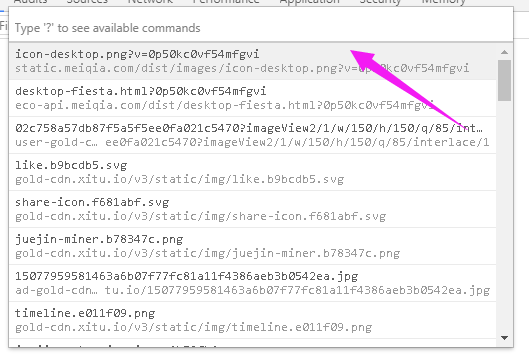
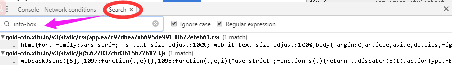
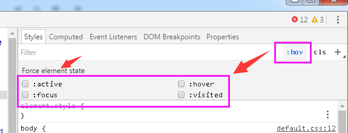

# Chrome 开发者工具（二）

上一章了解了console 的在控制台中的使用方法，本文来介绍一下开发者工具的快捷键的使用。

1. **Ctrl + p**：快速切换文件（在DevpTools 可以快速搜索和打开你项目中的文件）



2、**Ctrl + shift + f**：在源代码中搜索（搜索源代码的字符中特定串）

3、**Ctrl + g：**快速跳转到指定行

1. 

4、**Ctrl + o **：输入“？”，选择相应的操作

1. 

5、在控制台选择元素

* $\(\)–document.querySelector\(\)简写，返回第一个和css选择器匹配的元素。例如$\(‘div’\)返回这个页面中第一个div元素

* $$\(\)–document.querySelectorAll\(\)的简写，返回一个和css选择器匹配的元素数组。

* $0-$4–依次返回五个最近你在元素面板选择过的DOM元素的历史记录，$0是最新的记录，以此类推。


6、使用多个插入符进行选择（在console 面板操作）

```
 **按住 Ctrl ；鼠标点击要插入的地方**
```

7、保存记录（勾选在Console标签下的保存记录选项（**Preserve log**），你可以使DevTools的console继续保存记录而不会在每个页面加载之后清除记录。当你想要研究在页面还没加载完之前出现的bug时，这会是一个很方便的方法。）8、优质打印（或者叫做代码格式化：将页面引入的压缩过的代码解压出来）

```
    Chrome’s Developer Tools有内建的美化代码，可以返回一段最小化且格式易读的代码。Pretty Print的按钮在Sources标签的左下角（左下角有一个“{}”的符号）。
```

9、选择下一个匹配项

```
    在 source 文件：Ctrl + D
```

10、强制改变元素的状态

DevTools有个可以模拟CSS状态的功能，例如元素的hover和focus,可以很容易改变元素样式。在CSS编辑器中可以利用这个功能



11、改变颜色格式

在颜色预览功能使用快捷键**Shift + **点击，可以在rgba、hsl 和 hexadecimal 来回切换颜色的格式

12、直接编辑页面

```
 在console 中输入下列命令：document.designMode = "on";
```

13、使用** inspect（elem）**跳转到 elements 指定的元素节点

14、使用 **value（object）**获取对象的所有属性，返回数组

15、在source 面板中的 js 文件中使用 **alt + - 和 alt + =** 可以在上一个鼠标位置和下一个鼠标位置进行跳转

16、在 elements 面板上 对预览的图片右击 open ，在预览的图片右键选择 **copy image as data URI** ，可以将图片转为base64 编码

17、使用 **Ctrl + click** 可以创建多个编辑点，使用 **Ctrl + u** 可以取消最后一处编辑点

18、按住 alt 键，可以在文件中创建一个矩形选区

19、在 Elements 面板右侧的 Event Listeners 选项卡中，在绑定的事件上右键可以跳转到相应的 JS 代码

20、数值调整快捷键

**- Up / Down，增加或减少 1 单位**

**- Shift + Up / Down，增加或减少 10 单位**

**- Alt + Up / Down，增加或减少 0.1 单位            
**21、使用 **Ctrl + \[ 或者 \]** 可以循环切换开发者工具的各个面板

22、使用** console.trace\(\)** 可以追踪代码执行过程中的栈信息

23、使用** Tab 键**可以在 CSS 样式规则中进行遍历选定，选定的目标包括：选择器、属性和属性值。如果想跳回上一个目标，使用 **Shift + Tab**

24、**Ctrl + Shift + I**  ： 打开开发者工具窗口

25、**Ctrl + Shift + C**： 可以直接把鼠标发在页面上看具体的元素节点

26、可视化DOM阴影

```
    Web浏览器在构建如文本框、按钮和输入框一类元素时，其它基本元素的视图是隐藏的。不过，你可以在Settings - &gt;  General 中切换成Show user agent shadow DOM，这样就会在元素标签页中显示被隐藏的代码。甚至还能单独设计他们的样式，这给你了很大的控制权。
```


